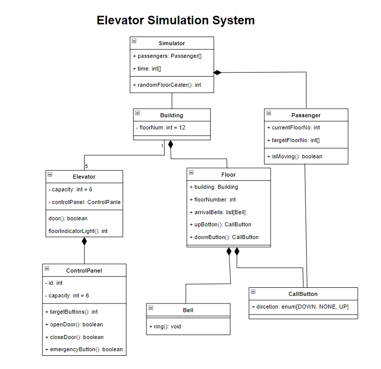

# Elevator Simulation System

According to the given problem statement, design a class diagram using the principles of Object-Oriented Programming and relationships between classes (Encapsulation, Inheritance, Polymorphism, Abstraction).

Kodluyoruz Insurance Company wants to construct a 12-story office building and equip it with the latest elevator technology. The company requests you to create a software simulator that models the operations of the elevators in the building to see if it meets the traffic flow needs within the building.

In the building, there will be five elevators capable of going up to the 12th floor. Each elevator has a capacity of approximately six adult passengers. The elevators are designed to be energy-efficient, so they only move when necessary. Each elevator has its own door, floor indicator light, and control panel. The control panel includes destination buttons, door open and close buttons, and an emergency signal button.

On each floor of the building, there is one door for each of the five elevator shafts, and each door has an arrival bell. The arrival bell indicates that an elevator has arrived at a floor. Each door also has a signal light above it, showing the arrival of the elevator and the direction in which the elevator is moving. Additionally, there are three sets of elevator call buttons on each floor.

A person calls an elevator by pressing the appropriate call button (up or down). A programmer assigns one of the five elevators to go to the starting floor of the call. After entering the elevator, a passenger typically presses one or more destination buttons. While the elevator moves from floor to floor, an indicator light inside the elevator informs passengers about the position of the elevator. When an elevator arrives at a floor, it is indicated by the lighting of the signal light above the external elevator door and the ringing of the floor bell. When an elevator stops at a floor, both groups of doors automatically open for a predetermined time, allowing passengers to enter and exit the elevator.

The simulator uses a "clock" to simulate real-time passage and records the events occurring during the simulation with a timestamp and log. To generate passengers and determine departure and arrival floors for each passenger, a random number generator is used.

Please design a class diagram based on this problem statement, utilizing Object-Oriented Programming principles and class relationships (Encapsulation, Inheritance, Polymorphism, Abstraction).

# Diagram
  
