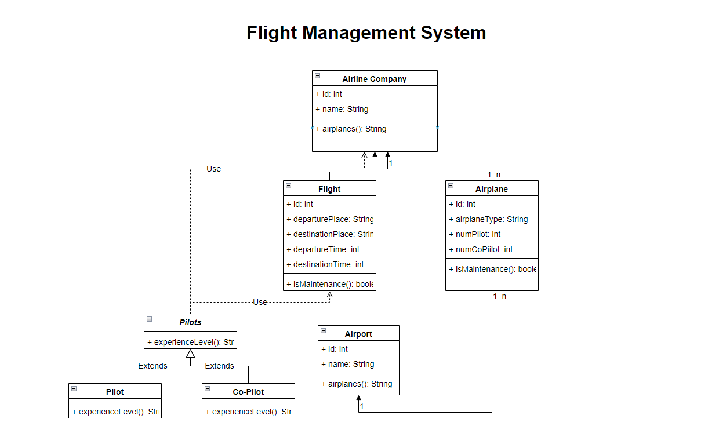

# Zoo Management System

Design a system for the management of flights and pilots.

 - Airline companies perform flights. Each airline has an identity.
 - An airline company has different types of airplane.
 - Airplane can be in working or repair status.
 - Each flight has a unique identity, departure and arrival airports, departure and arrival times.
 - Each flight has a pilot and a co-pilot who operate the aircraft.
 - Airports have unique identities and names.
 - Airline companies have pilots, and each pilot has an experience level.
 - Airplane type may require a specific number of pilots.

 Draw the Class diagram describing this system.

# Diagram
  
