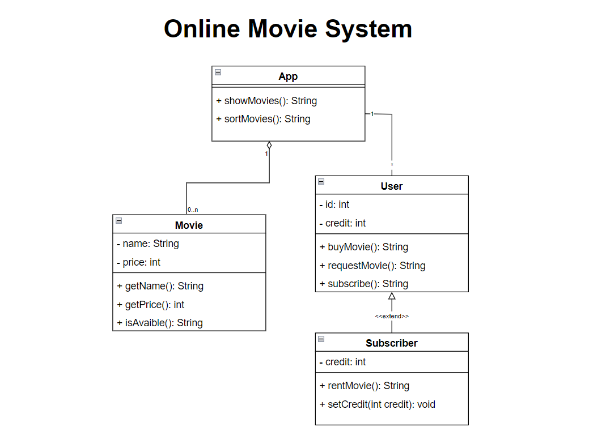

# Online Movie System

Design the system of an online movie selling or rental application.

 - In the application, movies can be listed, sorted, and users can subscribe to the application.
 - Users can purchase credits through the system for their subscription.
 - Only subscribed users can rent movies using their credits, and the rental fee will be deducted from their account accordingly.
 - Both regular users and subscribers can purchase movies.
 - If a movie is not available, it can be requested.

Please draw the Class diagram that represents this system.

# Diagram
  

